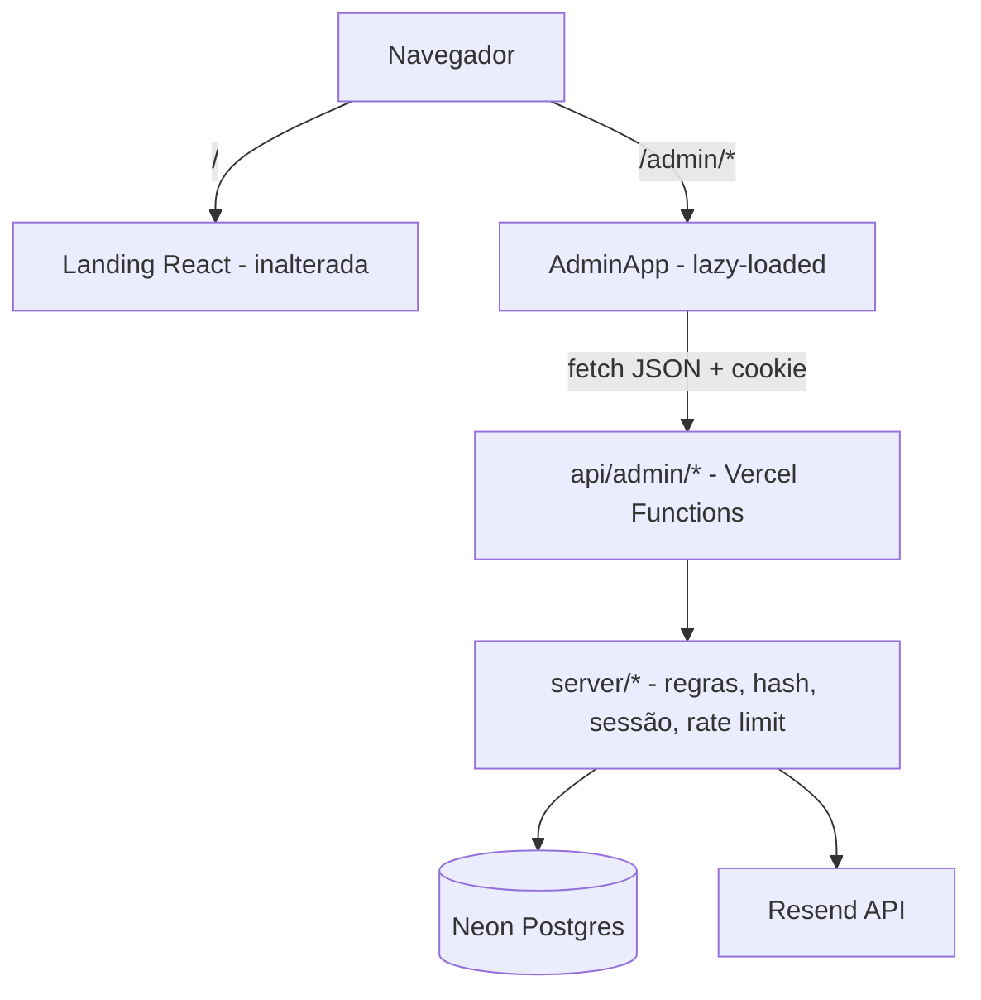

# Autenticação do Painel Administrativo Design

**Spec**: `.specs/features/admin-auth/spec.md`
**Status**: Approved (2026-10-04)

---

## Approaches Considered

Todas entregam o mesmo escopo da spec.

| Abordagem | Descrição | Prós | Contras |
| --------- | --------- | ---- | ------- |
| **A. Vercel Functions + Neon + Resend (recomendada)** | Handlers Web-standard em `api/`, lógica compartilhada em `server/`, SPA atual ganha rotas `/admin/*` | Mudança mínima; mantém Vite e a landing intactas; tudo na mesma plataforma de hospedagem | Precisa de `vercel dev` para testar `/api` localmente |
| B. Migrar o site para Next.js (App Router) | Auth com Route Handlers, middleware para proteger `/admin` | Proteção de rota nativa no middleware; ecossistema de auth maduro | Reescreve a landing inteira para um escopo que não exige isso |
| C. Provedor de auth gerenciado (Clerk) | Telas e sessões prontas do provedor | Menos código de segurança próprio | Contraria o pedido de telas e cadastro próprios; cobrança e dependência de terceiro |

**Recomendação: A.** A spec já exige telas próprias e o site é Vite; B reescreve o que não precisa mudar e C foi descartado pelo pedido.

---

## Architecture Overview



- `main.tsx` decide pelo `pathname`: `/admin*` carrega `AdminApp` via `React.lazy`; qualquer outro caminho renderiza a landing. A landing não baixa código do admin.
- Cada endpoint é um handler Web-standard (`(Request) => Response`), testável com `Request` puro, sem subir a Vercel.

---

## Code Reuse Analysis

### Existing Components to Leverage

| Component | Location | How to Use |
| --------- | -------- | ---------- |
| Design system `Button`, `Input`, `SectionHeading` | `window.ElianaLinoDesignSystem_6994f2` (via `src/_ds_bundle.js`) | Reuso nas telas de auth para manter a identidade visual |
| Tokens de cor e tipografia | `src/tokens/*.css`, `src/styles.css` | `var(--color-…)` nas telas admin; sem valores fixos |
| Validação de formulário | `zod` (já em `dependencies`) e `react-hook-form` + `@hookform/resolvers` | Mesmo schema no cliente e no servidor (`server/validation.ts`) |
| Padrão de validação e mensagens em PT-BR | `src/ui_kits/landing/Contact.tsx` | Mesmo tom das mensagens de erro |
| Testes | `vitest.config.ts` (jsdom) e `src/test/setup.ts` | Testes de componente; testes de API em ambiente `node` |

### Integration Points

| System | Integration Method |
| ------ | ------------------ |
| Landing (`src/ui_kits/landing`) | Não alterada; só o roteamento em `main.tsx` muda |
| Vercel rewrites | `vercel.json` manda caminhos fora de `/api` para `index.html`, para deep link de `/admin/*` |
| Neon Postgres | Provisionado pelo Marketplace; `DATABASE_URL` injetada pela integração |
| Resend | Provisionado pelo Marketplace; `RESEND_API_KEY` injetada pela integração |
| `@vercel/analytics` | Já na landing; avaliado em Risks |

---

## Components

### Server (`server/`)

**`server/db.ts`**
- **Purpose**: Cliente SQL único para as Functions. (Usado por AUTH-31: falha de banco → 503.)
- **Location**: `server/db.ts`
- **Interfaces**: `sql` (tagged template de `@neondatabase/serverless`), `transaction(queries)`
- **Dependencies**: `DATABASE_URL`
- **Reuses**: driver HTTP do Neon (sem pool, adequado a serverless)

**`server/config.ts`**
- **Purpose**: Lê e valida variáveis de ambiente; falha cedo com mensagem clara.
- **Interfaces**: `getConfig(): { databaseUrl, resendApiKey, appUrl, inviteCode, mailFrom }`
- **Dependencies**: `DATABASE_URL`, `RESEND_API_KEY`, `APP_URL`, `ADMIN_INVITE_CODE`, `MAIL_FROM`
- **Reuses**: —

**`server/auth/password.ts`**
- **Purpose**: Hash e verificação de senha com `scrypt`.
- **Interfaces**:
  - `hashPassword(password: string): Promise<string>` — formato `scrypt$N$r$p$saltB64$hashB64`, sal de 16 bytes
  - `verifyPassword(password: string, stored: string): Promise<boolean>` — comparação com `timingSafeEqual`
  - `DUMMY_HASH` — hash fixo usado para equalizar o tempo quando o e-mail não existe (AUTH-14/AC6)
- **Dependencies**: `node:crypto`
- **Reuses**: —

**`server/auth/tokens.ts`**
- **Purpose**: Gerar tokens opacos e guardar só o hash SHA-256.
- **Interfaces**: `newToken(): { token: string; hash: string }`, `hashToken(token: string): string`
- **Dependencies**: `node:crypto`

**`server/auth/session.ts`**
- **Purpose**: Criar, validar e revogar sessões; montar `Set-Cookie`.
- **Interfaces**:
  - `createSession(userId: string): Promise<{ cookie: string }>` — validade de 7 dias fixa
  - `getSessionUser(request: Request): Promise<SessionUser | null>` — ignora expiradas
  - `destroySession(request: Request): Promise<string>` — devolve cookie expirado
  - `revokeAllSessions(userId: string): Promise<void>`
- **Dependencies**: `server/db.ts`, `server/auth/tokens.ts`
- **Reuses**: —

**`server/auth/rateLimit.ts`**
- **Purpose**: Contar falhas recentes por chave (e-mail para login, IP para convite).
- **Interfaces**:
  - `isLimited(key: string): Promise<boolean>` — 5 falhas em 15 min (AUTH-10)
  - `recordFailure(key: string): Promise<void>`
  - `clear(key: string): Promise<void>` — chamado após login bem-sucedido
- **Dependencies**: tabela `failed_logins`

**`server/mail.ts`**
- **Purpose**: Envio de e-mails transacionais (redefinição e aviso de troca de senha).
- **Interfaces**: `sendPasswordReset(to, name, link)`, `sendPasswordChanged(to, name)`; ambos lançam erro, quem chama decide
- **Dependencies**: `RESEND_API_KEY`, `MAIL_FROM`
- **Reuses**: — (chamada HTTP direta à API do Resend com `fetch`; sem SDK, pois é um único endpoint)

**`server/validation.ts`**
- **Purpose**: Schemas `zod` de signup, login, esqueci-senha e redefinição, e a regra de senha.
- **Interfaces**: `signupSchema`, `loginSchema`, `forgotSchema`, `resetSchema`, `passwordRule`
- **Reuses**: `zod`; o cliente importa os mesmos schemas

**`server/http.ts`**
- **Purpose**: Helpers de resposta JSON e captura de erros padrão.
- **Interfaces**:
  - `json(status, body, headers?)`
  - `fail(status, message, field?)`
  - `withErrors(handler)` — converte exceções em 503 genérico e registra o erro no log

### API (`api/admin/`)

| Arquivo | Método | Status possíveis | Spec |
| ------- | ------ | ---------------- | ---- |
| `signup.ts` | POST | 201, 400, 403, 409, 503 | AUTH-01…07 |
| `login.ts` | POST | 200, 400, 401, 429, 503 | AUTH-08…13 |
| `logout.ts` | POST | 200 | AUTH-11 |
| `me.ts` | GET | 200, 401 | AUTH-14, AUTH-15 |
| `forgot-password.ts` | POST | 200, 400 | AUTH-20…24 |
| `reset-password.ts` | POST | 200, 400, 410, 503 | AUTH-25…29 |

Cada arquivo exporta apenas `POST` ou `GET` (Web-standard). Nenhum handler importa código de UI.

### Client (`src/admin/`)

**`src/admin/AdminApp.tsx`**
- **Purpose**: Raiz do painel: provedor de sessão e roteador por `pathname`.
- **Interfaces**: default export `AdminApp`
- **Reuses**: `AuthProvider`, páginas

**`src/admin/router.ts`**
- **Purpose**: Roteador mínimo sobre `history` (`pushState`, `popstate`) com `useSyncExternalStore`.
- **Interfaces**: `usePathname(): string`, `navigate(to: string, opts?: { replace?: boolean })`
- **Reuses**: — (não há roteador no projeto; dependência nova evitada)

**`src/admin/auth.tsx`**
- **Purpose**: Estado de sessão para o painel.
- **Interfaces**: `AuthProvider`, `useAuth(): { user, status: 'loading' | 'in' | 'out', refresh(), logout() }`
- **Dependencies**: `GET /api/admin/me` no mount

**`src/admin/ProtectedRoute.tsx`**
- **Purpose**: Renderiza filhos só com `status === 'in'`; com `'out'` navega para `/admin/entrar`; com `'loading'` mostra estado vazio (AUTH-14, AUTH-15).
- **Interfaces**: `ProtectedRoute({ children })`

**`src/admin/api.ts`**
- **Purpose**: `fetch` tipado para `/api/admin/*`, envia JSON, lê `{ message, field? }` de erros.
- **Interfaces**: `api.post<T>(path, body)`, `api.get<T>(path)`, `ApiError` com `status` e `field`

**Páginas** (`src/admin/pages/`):
- `LoginPage.tsx` — `/admin/entrar` (AUTH-08…13); redireciona para `/admin` se já logado (AUTH-18)
- `SignupPage.tsx` — `/admin/cadastro` (AUTH-01…07), campo de código de convite
- `ForgotPasswordPage.tsx` — `/admin/esqueci-senha` (AUTH-20…24); mostra sempre a mesma mensagem de sucesso
- `ResetPasswordPage.tsx` — `/admin/redefinir-senha` (AUTH-25…29); lê `token` da URL, aplica `history.replaceState` e envia no POST
- `DashboardPage.tsx` — `/admin` dentro de `ProtectedRoute`; cabeçalho com nome e e-mail (AUTH-30) e botão sair

**`src/admin/AdminLayout.tsx`**
- **Purpose**: Cabeçalho e moldura comum das telas autenticadas e das telas de auth.
- **Reuses**: Tokens de cor; nenhum componente novo além do necessário

---

## Data Models

### Banco (`server/schema.sql`)

```sql
create table if not exists users (
  id uuid primary key default gen_random_uuid(),
  name text not null check (char_length(name) between 2 and 120),
  email text not null unique check (email = lower(email)),
  password_hash text not null,
  created_at timestamptz not null default now()
);

create table if not exists sessions (
  token_hash text primary key,
  user_id uuid not null references users(id) on delete cascade,
  created_at timestamptz not null default now(),
  expires_at timestamptz not null
);
create index if not exists sessions_user_idx on sessions(user_id);

create table if not exists password_reset_tokens (
  token_hash text primary key,
  user_id uuid not null references users(id) on delete cascade,
  created_at timestamptz not null default now(),
  expires_at timestamptz not null,
  used_at timestamptz
);
create index if not exists reset_tokens_user_idx on password_reset_tokens(user_id);

create table if not exists failed_logins (
  id bigserial primary key,
  key text not null,
  attempted_at timestamptz not null default now()
);
create index if not exists failed_logins_key_idx on failed_logins(key, attempted_at);
```

**Migração:** `scripts/db-migrate.ts` executa `server/schema.sql` (idempotente, `if not exists`). Script `npm run db:migrate`.

### TypeScript

```typescript
interface SessionUser {
  id: string
  name: string
  email: string
}

interface ApiError {
  message: string
  field?: 'name' | 'email' | 'password' | 'inviteCode'
}
```

**Relationships:** `sessions` e `password_reset_tokens` pertencem a `users` com `on delete cascade`. `failed_logins` é independente e é limpo por rotina de leitura (registros com mais de 15 min são ignorados na contagem; a limpeza física fica como ponto em aberto abaixo).

---

## Key Flows

### Login (AUTH-08…13)

1. Valida `loginSchema`; inválido → 400.
2. `isLimited(email)`; sim → 429 (AUTH-10).
3. Busca usuário por e-mail normalizado. Sempre executa `verifyPassword` (usa `DUMMY_HASH` se não achou) (AUTH-13).
4. Falha → `recordFailure(email)`, 401 genérico (AUTH-09).
5. Sucesso → `clear(email)`, `createSession`, `Set-Cookie`, 200.

### Redefinição (AUTH-20…29)

1. `forgot-password`: sempre responde 200 com a mensagem fixa. Se o usuário existe: apaga tokens não usados, cria novo (30 min), envia e-mail. Erro de envio é logado e engolido (AUTH-23).
2. `reset-password`: busca por `token_hash`; ausente, usado ou expirado → 410 (AUTH-26). Valida nova senha (400 sem consumir token).
3. Em `transaction`: marca token usado, atualiza `password_hash`, apaga todas as `sessions` do usuário (AUTH-25). Após commit, envia aviso (falha não desfaz, AUTH-28).

### Acesso ao painel (AUTH-14, AUTH-15, AUTH-19)

1. `AuthProvider` chama `GET /api/admin/me` ao montar.
2. 200 → `status = 'in'`; 401 → `'out'`.
3. `ProtectedRoute` redireciona em `'out'`. A API de `me` e das demais rotas protegidas usam `getSessionUser`; sem sessão → 401 com `Set-Cookie` expirando o cookie quando havia cookie inválido (AUTH-14, AUTH-19).

---

## Cookies e segurança

- Nome: `admin_session`. Atributos: `HttpOnly; Secure; SameSite=Lax; Path=/; Max-Age=604800`.
- Token: 32 bytes via `crypto.randomBytes`, base64url. Banco guarda SHA-256 hex.
- `SameSite=Lax` bloqueia envio do cookie em POST cross-site, o que cobre CSRF nas rotas de estado.
- Sessão tem validade absoluta de 7 dias (sem renovação deslizante, AUTH-12).

---

## Error Handling Strategy

| Error Scenario | Handling | User Impact |
| -------------- | -------- | ----------- |
| JSON inválido ou campo ausente | `safeParse` do zod → 400 com `field` | Mensagem no campo |
| Banco indisponível | `withErrors` loga e responde 503 genérico | "Serviço temporariamente indisponível" (AUTH-31) |
| Variável de ambiente ausente | `getConfig()` lança na primeira chamada; 503 + log | Mesma mensagem genérica; erro claro nos logs |
| Resend falha no esqueci-senha | Loga, responde 200 | Mensagem neutra (AUTH-23) |
| Resend falha no aviso de troca | Loga, não altera resposta | Nenhum impacto |
| Cookie adulterado, expirado ou de conta removida | Hash não encontrado → 401 + cookie expirado (AUTH-19) | Redireciona para login |
| Dois cadastros simultâneos | `unique` em `email`; erro `23505` vira 409 | "Já existe uma conta…" |

---

## Risks & Concerns

| Concern | Location (file:line) | Impact | Mitigation |
| ------- | -------------------- | ------ | ---------- |
| Código de convite é segredo compartilhado sem limite de tentativas | `api/admin/signup.ts` (novo) | Brute force do convite criaria conta de admin | Rate limit por IP reutiliza `failed_logins` (chave `invite:<ip>`); recomendar convite de 24+ caracteres aleatórios no `.env` |
| Rate limit só por e-mail | `server/auth/rateLimit.ts` (novo) | Atacante troca o e-mail e não é bloqueado | Limite por IP também, chave `login-ip:<ip>` com teto maior (20 falhas/15 min); fica como item de Tasks |
| Token de redefinição na URL | `src/admin/pages/ResetPasswordPage.tsx` (novo) | Vazamento por histórico, Referer ou ferramenta de analytics | `replaceState` após leitura; `Referrer-Policy: strict-origin-when-cross-origin` (padrão) e nenhum recurso de terceiro na tela; verificar se `@vercel/analytics` envia query string |
| Admin inflando o bundle da landing | `src/main.tsx:1` | Visitantes baixam código do painel | `React.lazy` para `AdminApp`, carregado só em `/admin*` |
| `vercel dev` necessário para testar `/api` | fluxo de desenvolvimento | `npm run dev` não serve as Functions | Documentar em `README.md`; testes de API rodam sem servidor |
| `failed_logins` cresce sem limite | `server/schema.sql` | Consulta e armazenamento crescem com o tempo | Consulta sempre filtra por janela de 15 min; limpeza do que passou de 1 dia entra como task de manutenção |
| Vazamento do motivo de falha no login | `api/admin/login.ts` (novo) | Enumeração de contas | Mensagem única (AUTH-09) e tempo equalizado com `DUMMY_HASH` |
| Cadastro aberto por engano | `api/admin/signup.ts` (novo) | Qualquer pessoa vira admin | Sem `ADMIN_INVITE_CODE` configurado a rota responde 503; nunca cai para cadastro aberto |
| Testes de cobertura inexistentes para API | — | Regressão de segurança passa despercebida | Suíte de testes por AC P1/P2 (task dedicada) |

---

## Tech Decisions (only non-obvious ones)

| Decision | Choice | Rationale |
| -------- | ------ | --------- |
| Runtime do backend | Vercel Functions com handlers Web-standard em `api/` | Mesma plataforma do site; sem servidor próprio |
| Driver do banco | `@neondatabase/serverless` (HTTP) | Adequado a Functions curtas; sem pool para gerenciar |
| Hash de senha | `scrypt` (`node:crypto`), N=16384, r=8, p=1 | Sem dependência nativa; parâmetros padrão do Node |
| Sessão | Token opaco em cookie, hash no banco | Revogação imediata no logout e na redefinição |
| Envio de e-mail | `fetch` direto para a API REST do Resend | Um endpoint; evita SDK |
| Roteamento do painel | Roteador próprio de ~40 linhas sobre `history` | Evita dependência nova para 5 telas |
| Validação | `zod` compartilhado entre cliente e servidor | Uma única fonte das regras de senha e campos |
| Testes de API | Vitest em ambiente `node`, chamando handlers com `Request` | Não exige `vercel dev` no CI |

> **Project-level decisions:** as escolhas de backend (Functions + Neon + Resend), roteamento do `/admin` lazy-loaded e a camada de sessão serão registradas em `.specs/STATE.md` como `AD-001`…`AD-003`.

---

## Pontos em aberto para Tasks

- Limite por IP no login (decidido acima como item de Tasks, não bloqueante).
- Limpeza física de `failed_logins` (manutenção, pode ficar para depois).
